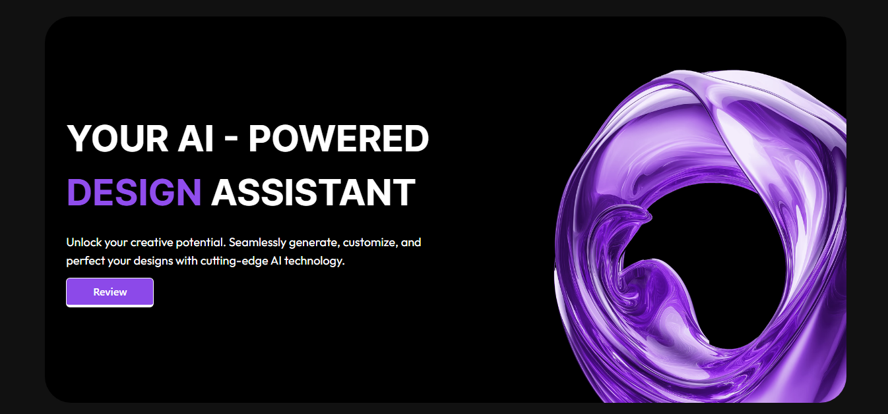

# Njam.Ai 🤖

**Njam.Ai** is a responsive, animated clone of a modern AI assistant website — built using **React**, **Tailwind CSS**, **GSAP**, and **Framer Motion**. This frontend-only project delivers a sleek and interactive landing experience inspired by real-world AI platforms.

🔗 **Live Preview:** [njam-ai.vercel.app](https://njam-ai.vercel.app/)



---

## 🧰 Tech Stack

- ⚛️ React (via Vite)
- 🎨 Tailwind CSS
- 🎞️ GSAP (GreenSock Animation Platform)
- 🌀 Framer Motion
- ⚡ Vite

---

## 🚀 Getting Started

To run this project locally:

```bash
git clone https://github.com/Sannan144/Njam.Ai.git
cd Njam.Ai
npm install
npm run dev
